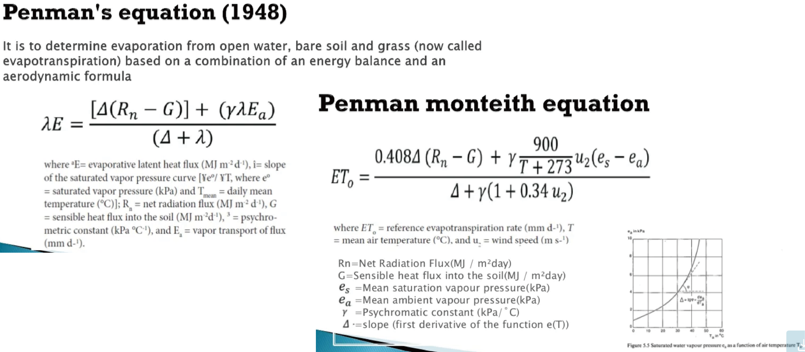

[TOC]

[TOC]

# Highlight of inside meeting

- 農業需求: 10公尺尺度的土壤溼度預測

## Insights
以平穩過程為目標
- 以差值(diff)去趨勢、使得 ACF (autocorrelation function) 展現低記憶效應($t_{n=i}$ 與 $t_{n=i-1, i-2, ...}$的關連性隨$n$增加很快地降低)
- 取 $\log$

Time shift
- use ACF (AutoCorrelation Function) to decide $t_{i, i=-1,-2, \text{or }?...}$

### Granger Causality test
Check whether a feature (e.g., precipitation) is a effective "cause"
- for precipitation, yes
- `soil_water_content_t-1` seems not able to predict `soil_water_content_t0`

### ideas or keywords that may or may not be helpful
- Confusion Matrix & Statistics: To see the importance of features (factors)
- use CNN $\rightarrow$ heatmap to view target feature
- [CNN attention transformer](https://hackmd.io/@abliu/BkXmzDBmr)
- [Boruta: feature selection algorithm](https://towardsdatascience.com/boruta-explained-the-way-i-wish-someone-explained-it-to-me-4489d70e154a); [PyCall BorutaPy and Shapley values ShapML.jl](https://discourse.julialang.org/t/boruta-algorithm/76821)

## Earthquake prediction
- use AI to find what featrue relates to earthquake
- AI may support/prove whether final seismic size is deterministic by the first few seconds
- whether an earthquake is a foreshock of a bigger one

# TO-DOs
TODO: try `SWC_30cm` of site Tower (continue from `decisiontree_20220527/SET_Tower_30cm`)
TODO: test whether 5-day accumulated precipitation helps prediction in `SWC_30cm`

### TODO: For CCC
He wants to focus on a small dataset (e.g., ARI), tuned the model/overflow to the best, and then extends the model/overflow to a large dataset
- plot learning curve for subsets of feature selection for ARI dataset; this is intended for CCC. 

### TODO: For NEXT report
- plot learning_curve! with number of trees (for random forest); heatmap of performance for two hyper-parameter (e.g. `n_subfeatures` v.s. `bagging_fraction`);see [this](https://juliaai.github.io/DataScienceTutorials.jl/getting-started/ensembles-2/).

### TODO: Try these features
- try `no_rain_hour_t0`; test `precipitation_2day` and `precipitation_3day` without time-shift (there seems no requirement to shift them)
- averaged temperature as input variable
- wind speed
- solar radiation
- use calculated (not observed) `SWC_10cm` as input feature to predict `SWC_30cm`

### TODO: Try model composition
- one model for absolute SWC nowscast, one for predicting SWC increment
- one model that learns from the data of the entire year (or season); one for the recent month

### TODO: better imputation
- it is OK to impute data in testing phase with mean
- for training dataset, after series to supervised, delete all rows that has missing value; `series2supervise` has to allow missing (or NaN) 

### todo: less important
- record the necessary information about series-to-supervised process that we can restore `Xtrain`,`Xtest`,`ytrain`,`ytest` from input features' name (and its order) from the original data.

## Log
#### 2022-08-22
Highlight
- the most dominant predictor (i.e., `precipitation_1d_t0`)
- study relevance between depth and time scale (include time lag & accumulating time)
- we had debates on coarse graining, and there is still no conclusion yet (and the issue is halt that temporary I need to do nothing)

Insights
- what if we exclude the most dominant predictor (i.e., `precipitation_1d_t0`)?
- how does the key features the model (tree) tell us links to parameters in the hydrological model (precipitation as a function of time ↔️ `precipitation_1d_t0`, `_t-1`, `_t-2`...)

#### 2022-10-12
##### 期中報告審查要點
- 是否將預測結果公開
- 為何使用此技術、帶來什麼改變? 
  > Ans: 計算速度短，可即時、針對大量目標預測。
- 希望在來年看到容許度的提升。

##### 蒸發散模式

- 根據輻射、濕度、風速等推算蒸發散
- 建立在無雨的狀況假設下

##### Tolerance
"猜錯的話可撐多久"：預測誤差的水量在實際應用場景的緩衝時間是多少
- 假設以下場景：SWC 低至20% 再澆水；15% 開始枯死；5% 水量可供稻米用5天。目前預測值是25%，真值20%，那容許度為5天。(大概是這樣的感覺)
- 之前定陳沛芫老師訂定的 "目標誤差低於5%" 就是在這個邏輯下計算得到的。

##### 點子
- 目標預測 $t_{+n}$ SWC。
- 以降雨為主的變數預測 $t_0$ 土水絕對值 $Y_{p, t0}$。(`mach_a`)
- 以蒸發散模式變數預測 $t_0$ 至 $t_{+n}$ 土水增值 $\Delta Y_{p, t0n}$。(`mach_b`)
- 直接預測 $t_{+n}$ 土水絕對值 $Y_{p, tn}$。(`mach_ax`)
- 預測未來區間內 ($t_0$至 $t_n$)會不會下雨。(`mach_NN`)
  - Yes ➡️ use `mach_ax`: $Y_{pred} = Y_{p, tn}$
  - No  ➡️ use `mach_a` + `mach_b`: $Y_{pred} = Y_{p, t0} + \Delta Y_{p, t0n}$